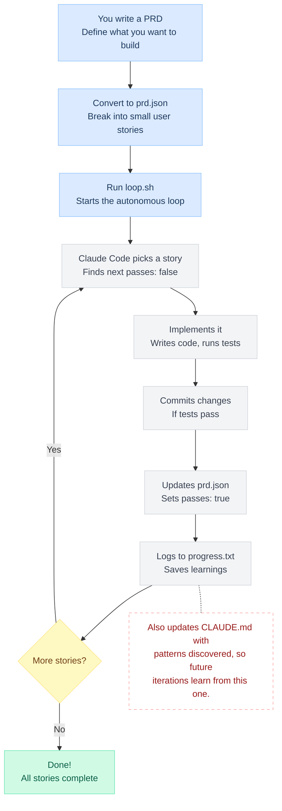

# Loop Flowchart

```mermaid
flowchart TD
    A["You write a PRD<br/>Define what you want to build"]
    B["Convert to prd.json<br/>Break into small user stories"]
    C["Run loop.sh<br/>Starts the autonomous loop"]
    D["Claude Code picks a story<br/>Finds next passes: false"]
    E["Implements it<br/>Writes code, runs tests"]
    F["Commits changes<br/>If tests pass"]
    G["Updates prd.json<br/>Sets passes: true"]
    H["Logs to progress.txt<br/>Saves learnings"]
    I{"More stories?"}
    J["Done!<br/>All stories complete"]

    A --> B --> C --> D --> E --> F --> G --> H --> I
    I -- "Yes" --> D
    I -- "No" --> J

    NOTE["Also updates CLAUDE.md with<br/>patterns discovered, so future<br/>iterations learn from this one."]

    H -.- NOTE

    classDef blue fill:#dbeafe,stroke:#93c5fd,color:#1e3a5f
    classDef gray fill:#f3f4f6,stroke:#d1d5db,color:#374151
    classDef yellow fill:#fef9c3,stroke:#fde68a,color:#713f12
    classDef green fill:#d1fae5,stroke:#6ee7b7,color:#065f46
    classDef note fill:#fff,stroke:#fca5a5,stroke-dasharray:5 5,color:#991b1b

    class A,B,C blue
    class D,E,F,G,H gray
    class I yellow
    class J green
    class NOTE note
```
